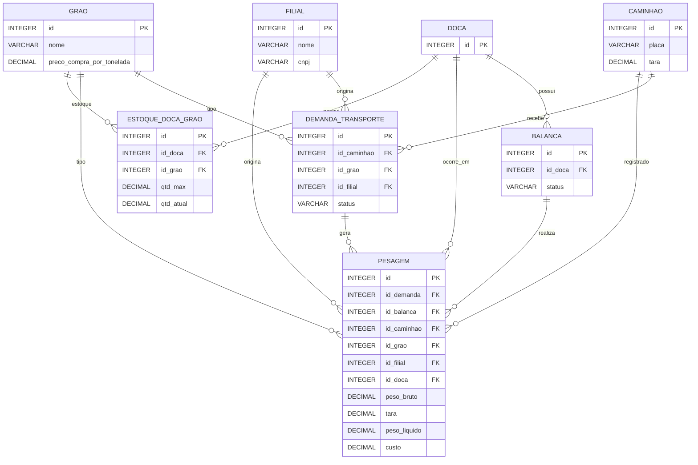

# Core - Sistema de Gerenciamento de Transporte de Grãos


Sistema desenvolvido para gerenciar o transporte e pesagem de grãos, oferecendo controle completo do processo desde a demanda de transporte até a pesagem final estabilizada.

---

## Funcionalidades

### Principais Módulos

* **Gestão de Filiais**
* **Gestão de Caminhões** (inclui tara)
* **Gestão de Grãos** (inclui preço de compra por tonelada)
* **Gestão de Docas**
* **Sistema de Balanças**
* **Demandas de Transporte**
* **Pesagem Automatizada com Estabilização**

### Funcionalidades Avançadas

* Estabilização automática das leituras de peso
* Processamento assíncrono via mensageria (RabbitMQ)
* APIs RESTful
* Documentação com Swagger/OpenAPI
* Auditoria automática

---

## Tecnologias Utilizadas

| Tecnologia        | Versão  | Uso                    |
| ----------------- | ------- | ---------------------- |
| Java              | 21      | Linguagem principal    |
| Spring Boot       | 3.5.7   | Framework principal    |
| Spring Data JPA   | -       | Persistência           |
| SQLite            | 3.45.0  | Banco de dados         |
| Hibernate         | 6.5.0   | ORM                    |
| SpringDoc OpenAPI | 2.6.0   | Documentação           |
| Lombok            | 1.18.34 | Redução de boilerplate |
| Gradle            | -       | Build                  |

---

## Como Executar

### Pré-requisitos

* Java 21+
* Gradle (ou usar o wrapper incluído)
* Docker

---

## Subindo o RabbitMQ (Obrigatório)

O sistema utiliza **RabbitMQ** para processar medições e eventos de pesagem.
Sem o RabbitMQ funcionando, nenhuma leitura de balança será processada.

### Executando via Docker

```bash
docker run -d --hostname rabbit --name rabbitmq \
  -p 5672:5672 -p 15672:15672 \
  rabbitmq:3-management
```

### Acesso ao painel administrativo

* URL: [http://localhost:15672](http://localhost:15672)
* Usuário: `guest`
* Senha: `guest`

---

## Inicializando a Aplicação

1. Clone o repositório:

```bash
git clone <url-do-repositorio>
cd core
```

2. Execute:

```bash
./gradlew bootRun
```

Ou:

```bash
gradle bootRun
```

3. Endpoints:

* API: [http://localhost:8080](http://localhost:8080)
* Swagger UI: [http://localhost:8080/swagger-ui.html](http://localhost:8080/swagger-ui.html)

---

## Banco de Dados

O banco SQLite é criado automaticamente na primeira execução conforme o arquivo:

[`schema.sql`](src/main/resources/database/schema.sql)

### Modelo de Dados (ERD)



---

## Sistema de Estabilização e Arquitetura de Medição

Para detalhes completos sobre:

* Funcionamento do algoritmo de estabilização
* Processamento assíncrono (eventos)
* Critérios de estabilização
* Arquitetura do pipeline de leitura → estabilização → pesagem consolidada

Acesse:

[`docs/estabilizacao.md`](docs/Lógica%20de%20estabilização.md)
[`docs/arquitetura-eventos.md`](docs/Arquitetura%20de%20Medição.md)

---

## Documentação da API

Com a aplicação rodando:

* Swagger UI: [http://localhost:8080/swagger-ui.html](http://localhost:8080/swagger-ui.html)
* OpenAPI JSON: [http://localhost:8080/v3/api-docs](http://localhost:8080/v3/api-docs)
