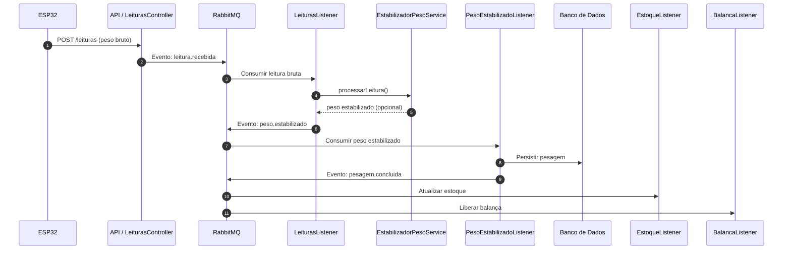

# ⚙️ **Arquitetura de Mediçao e Processamento Assíncrono**

O sistema de pesagem foi projetado para lidar com **alto volume de leituras** enviadas pelos ESP32 a cada 100ms. Para garantir escalabilidade, resiliência e desacoplamento entre etapas, toda a pipeline funciona sobre um **modelo assíncrono baseado em eventos** utilizando RabbitMQ (ou Kafka).

A seguir descrevemos cada parte do fluxo.

---

## 🛰️ **1. Ingestão das Leituras da Balança (API REST)**

As leituras brutas enviadas pelo ESP32 chegam ao endpoint:

```
POST /v1/leituras
```

Exemplo de payload:

```json
{
  "id": 1,
  "plate": "ABC1234",
  "weight": 30150
}
```

A controller (`LeituraController`) **não processa a leitura diretamente**.
Em vez disso, ela:

1. **Valida a balança e o caminhão**.
2. Publica a leitura bruta na fila **leituras.balanca** via RabbitMQ.
3. Retorna `202 ACCEPTED` imediatamente.

Isso evita travar a API mesmo quando há grande volume de leituras.

**Vantagens:**

* API permanece rápida (< 5ms)
* Leituras podem ser processadas por vários workers simultaneamente
* Sistema fica resiliente a picos de tráfego

---

## 🔄 **2. Fase de Estabilização do Peso**

As leituras enviadas pela API são capturadas pelo listener:

```
LeiturasListener
```

Ele trabalha consumindo mensagens da fila:

```
FILA_LEITURAS_BALANCA
```

com paralelismo configurado:

```
concurrency = "3-10"
```

Isso significa que **entre 3 e 10 workers** podem rodar em paralelo, aumentando a capacidade de ingestão.

O listener chama:

```
estabilizadorPesoService.processarLeitura(leitura)
```

Esse serviço aplica o algoritmo de estabilização baseado em:

* janela deslizante (rolling window)
* variação mínima permitida
* tempo mínimo estável
* média das leituras

Quando o peso **ainda está instável**, nada é emitido.
Quando o peso **estabiliza**, o listener publica um novo evento:

```
balanca.peso.estabilizado
```

Esse evento já contém:

* peso bruto estabilizado
* placa do caminhão
* id da balança
* timestamp

Portanto, o sistema converte **milhares de leituras brutas** em **uma única leitura consolidada**.

---

## 📦 **3. Consolidação da Pesagem**

Quem consome o evento de peso estabilizado é o:

```
PesoEstabilizadoListener
```

Esse componente realiza a segunda fase do fluxo:

1. Busca a demanda de transporte ativa para aquela placa.
2. Busca os dados da balança, caminhão e grão.
3. Calcula:

    * peso líquido
    * tara
    * custo da carga
4. Monta a entidade `PesagemEntity`.
5. Salva a pesagem no banco.
6. Emite o evento final:

```
balanca.pesagem.concluida
```

Esse é o evento que sinaliza que a pesagem está **totalmente finalizada e persistida**.

---

## 🏭 **4. Pós-Processamentos da Pesagem**

O evento `pesagem.concluida` é consumido por múltiplos serviços especializados.
Isso permite um modelo de **event-driven micro-operations**, onde cada ação fica isolada.

### ✔ **4.1. Atualização do Estoque da Doca**

Listener:

```
PesagemConcluidaEstoqueListener
```

Ações:

* Localiza o estoque daquela doca e tipo de grão.
* Debita a quantidade correspondente ao peso líquido.
* Persiste o novo valor de estoque.

### ✔ **4.2. Liberação da Balança**

Listener:

```
PesagemConcluidaBalancaListener
```

Ações:

* Marca a balança como "livre" para receber outro caminhão.
* Atualiza status no banco (e opcionalmente envia notificações).

---

# 🔁 **Resumo Geral do Fluxo de Eventos**



---

# 🏗️ **Componentes da Arquitetura**

| Componente                   | Função                                           |
| ---------------------------- | ------------------------------------------------ |
| **LeituraController**        | Recebe a leitura bruta e publica na fila         |
| **LeiturasProducer**         | Valida dados e envia para RabbitMQ               |
| **LeiturasListener**         | Processa leituras brutas e detecta estabilização |
| **PesoEstabilizadoListener** | Consolida a pesagem e salva no banco             |
| **EstoqueDocaGraoListener**  | Atualiza estoque após pesagem concluída          |
| **BalancaListener**          | Libera a balança para o próximo caminhão         |

