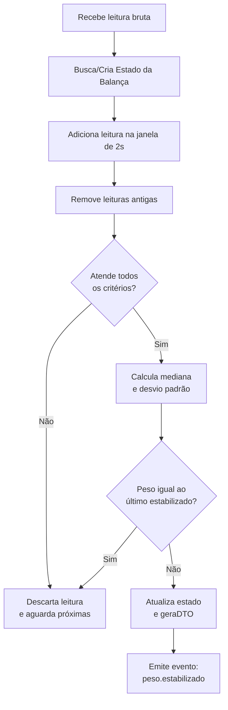

# **Lógica de Estabilização do Peso**

O sistema implementa uma estratégia robusta para detectar **quando o peso enviado pela balança está realmente estabilizado**, evitando salvar leituras oscilantes ou parciais.

A estabilização ocorre em três etapas:

1. **Manutenção de uma janela deslizante de leituras**
2. **Aplicação de múltiplos critérios de estabilização**
3. **Cálculo do valor estabilizado (mediana) e geração do evento**

A seguir, cada parte do processo é explicada.

---

# **1. Janela Deslizante de Leituras (Sliding Window)**

Para cada balança, o sistema mantém um objeto `EstadoBalanca`, que contém:

* ID da balança
* placa do caminhão
* lista das leituras recentes (peso + timestamp)
* último peso estabilizado
* instante da última estabilização

Cada nova leitura recebida é:

1. adicionada ao estado
2. leituras mais antigas que **2 segundos** são descartadas:

```java
double janelaSegundos = 2.0;
estado.getLeituras().removeIf(r -> r.getTimestamp().isBefore(limiteTempo));
```

Assim, a cada momento temos uma janela móvel de **aprox. 20 leituras** (considerando 100ms por leitura).

---

# **2. Aplicação dos Critérios de Estabilização**

A estabilização NÃO depende de um único critério.
Ela só ocorre se **todos** os critérios registrados forem verdadeiros:

```java
criterios.stream().allMatch(criterio -> criterio.avaliar(estado));
```

Atualmente, dois critérios estão implementados:

---

## **Critério 1 — Mínimo de Leituras (CriterioMinimoLeituras)**

Evita considerar estabilização se ainda houver poucas medições.

```java
int minimoLeituras = 15;
return estado.getLeituras().size() >= minimoLeituras;
```

### Motivo:

* Impede estabilização precoce
* Garante que a mediana e outros cálculos tenham amostras suficientes
* Melhora a precisão da estimativa final

---

## **Critério 2 — Variação Máxima Permitida (CriterioVariacaoMaxima)**

Calcula:

* maior peso da janela (`max`)
* menor peso (`min`)
* média dos valores (`media`)
* variação percentual:

```
variacao = (max - min) / media * 100
```

Se a variação for **≤ 0.5%**, então é considerada estável.

```java
double variacaoMaximaPercentual = 0.5;
return variacao <= variacaoMaximaPercentual;
```

### Motivo:

O sistema considera que pesos com oscilação menor que **0.5% da média** estão praticamente estáveis.

Exemplo:

* média = 32.000 kg
* max = 32.050 kg
* min = 32.030 kg
* variação = 0.062% → **dentro do limite**

---

# **3. Cálculo do Peso Estabilizado**

Se todos os critérios forem atendidos, o sistema produz o valor estabilizado utilizando a **mediana** das leituras:

```java
BigDecimal pesoEstabilizado = CalculadoraEstatistica.calcularMediana(pesos);
```

### Por que mediana?

* mais resistente a ruídos
* não distorce com outliers (ex.: leituras momentaneamente erradas)
* tende a representar melhor o "peso real"

Também é calculado o **desvio padrão**, utilizado para monitoramento e análise da qualidade da balança.

---

# **4. Idempotência de Estabilização**

Se o peso estabilizado for igual ao último estabilizado, nada é emitido:

```java
if (estado.getUltimoPesoEstabilizado() != null &&
    estado.getUltimoPesoEstabilizado().equals(pesoEstabilizado)) {
    return Optional.empty();
}
```

Isso evita:

* duplicar eventos
* duplicar pesagens
* reprocessamentos desnecessários

---

# **5. Emissão do Evento de Peso Estabilizado**

Se tudo estiver correto, o sistema retorna:

```java
new PesoEstabilizadoDTO(
    balancaId,
    placa,
    pesoEstabilizado,
    timestamp,
    quantidadeDeLeituras,
    desvioPadrao
)
```

Esse objeto é publicado na fila:

```
balanca.peso.estabilizado
```

E segue para a etapa de consolidação da pesagem.

---

# **Resumo da Lógica**



---

